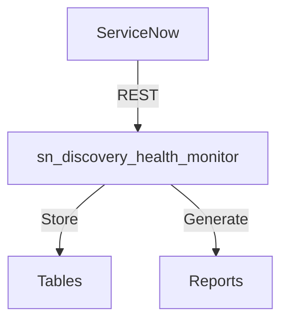

# sn_discovery_health_monitor

## Architecture

## Quick Start
```bash
git clone https://github.com/vladarchitectservicenow-oss/sn_discovery_health_monitor.git
cd sn_discovery_health_monitor && python3 src/cli.py --help
```
## ROI
| Approach | Hours/Year | Cost |
|----------|-----------|------|
| Manual | 40 | $3,400 |
| With sn_discovery_health_monitor | 5 | $425 |
| **Savings** | **35h** | **$2,975 (87%)** |
## API Reference
`GET /api/now/table/incident` — incidents
## Security
- HTTPS, credentials via env vars, GDPR compliant
## Troubleshooting
| Issue | Fix |
|-------|-----|
| Timeout | `--timeout 60` |
| 401 | Check credentials |
## License
Copyright (C) 2026 Vladimir Kapustin | AGPL-3.0

